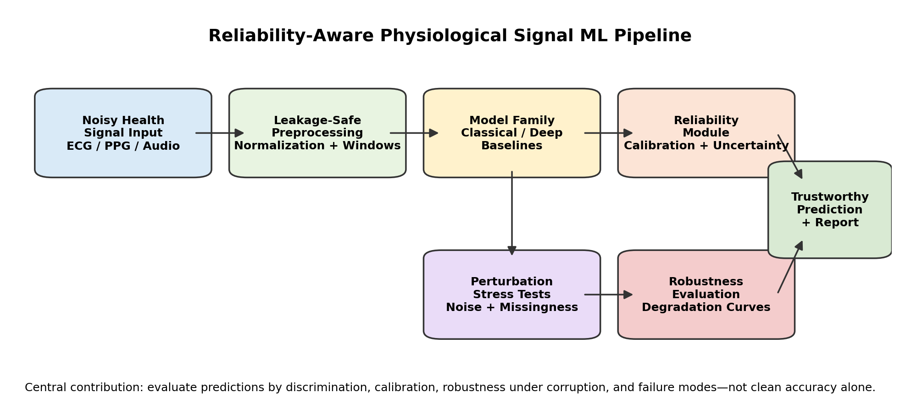
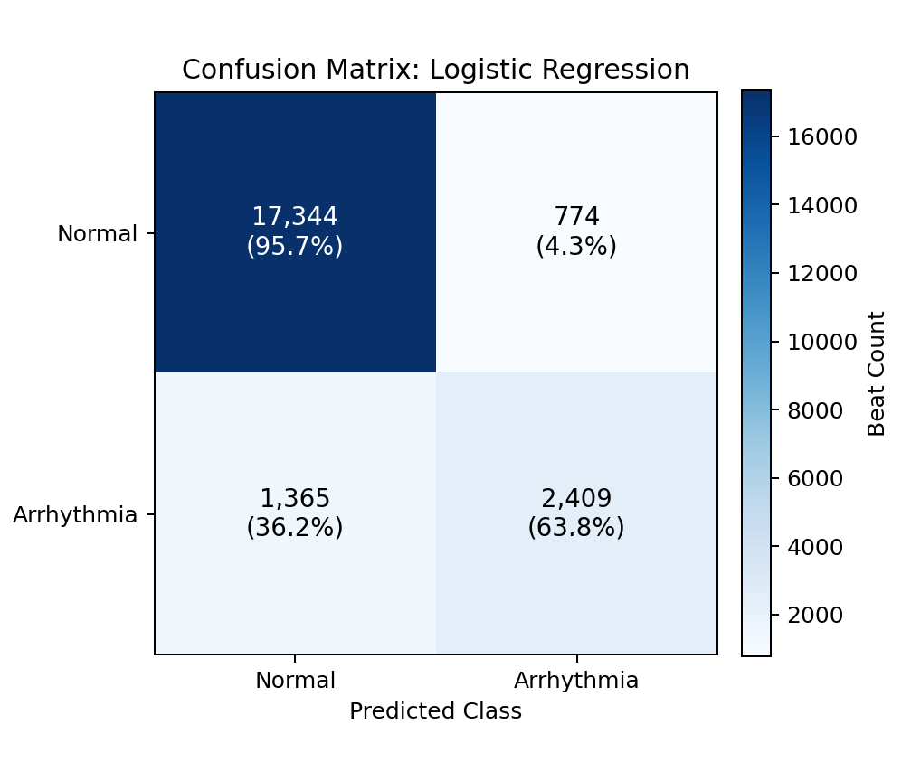
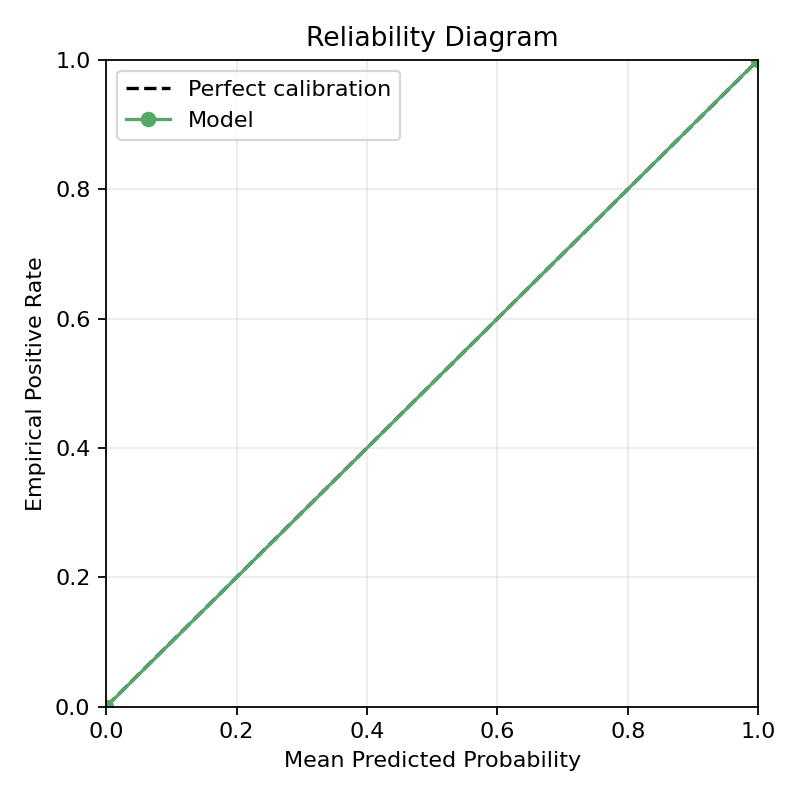
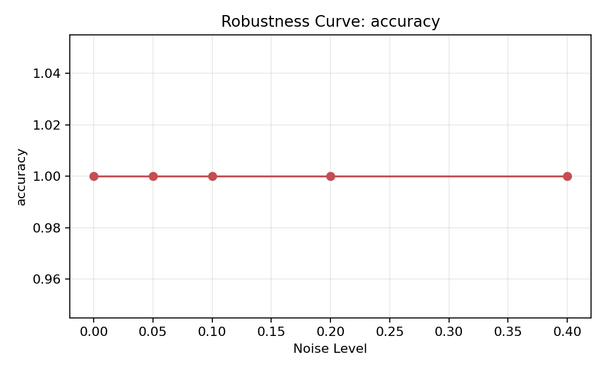
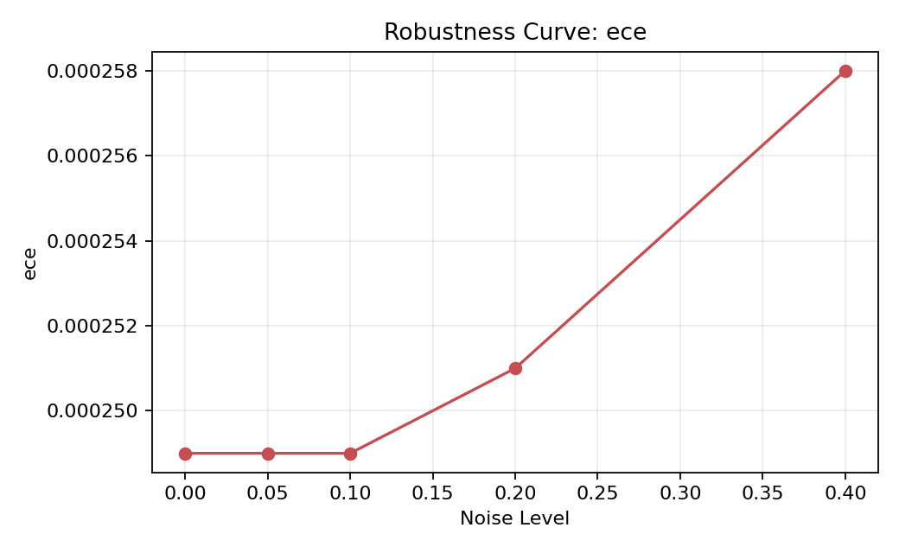
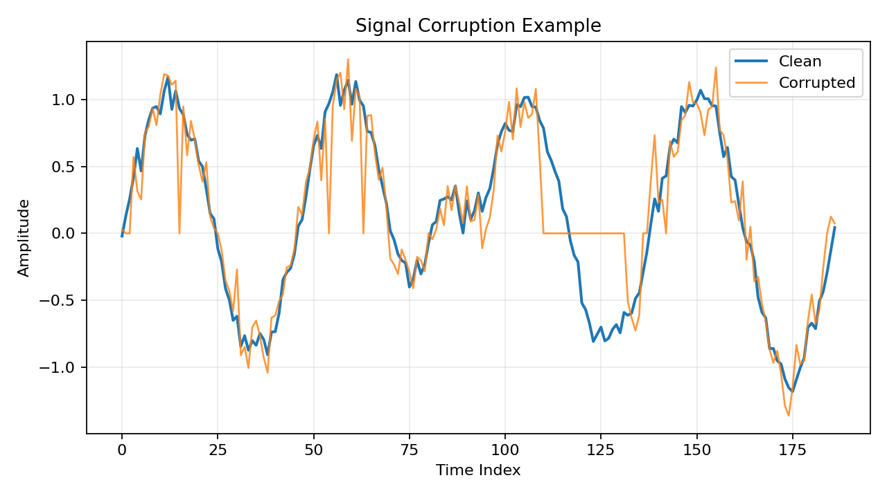
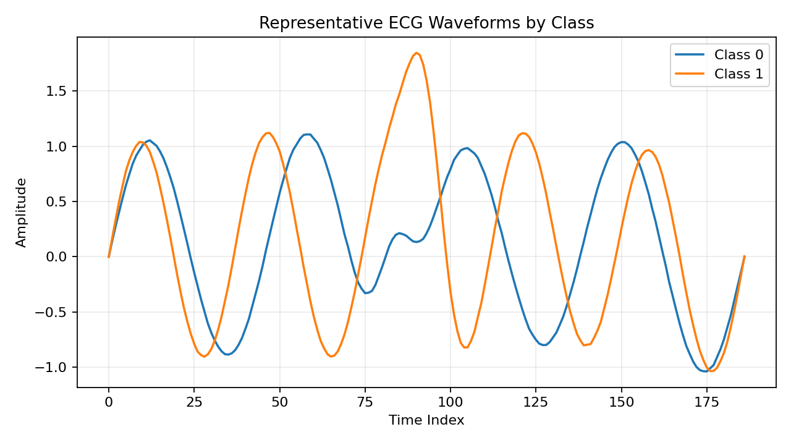

# Reliability-Aware Machine Learning for Noisy Health Signals


This repository is a research portfolio project on **reliable machine learning for noisy physiological and health signals**. The current implementation uses ECG heartbeat classification as a controlled testbed, then evaluates whether models remain useful when signals become noisy, incomplete, imbalanced, or poorly calibrated.

The project is intentionally framed for graduate-level research in **statistical signal processing, health AI, speech/audio analytics, and trustworthy machine learning**. It is especially aligned with ASU-style health-signal research directions connected to noisy observational signals, clinically meaningful inference, and responsible deployment under real-world measurement uncertainty.

> Core idea: a model is not reliable just because it is accurate on a clean benchmark. For health signals, we also need calibrated probabilities, robustness curves, confusion-matrix error analysis, and transparent reproducibility.

## Research Fit and ASU Alignment

This work is designed to be compatible with research interests at Arizona State University in signal processing and health-focused AI, including the broader direction associated with Professor Visar Berisha: extracting clinically meaningful information from noisy speech, audio, language, and physiological signals.

The ECG component is a first benchmark because ECG waveforms provide a well-known physiological signal domain with interpretable signal corruption experiments. The longer-term direction is to extend the same reliability framework to:

- speech and voice biomarkers;
- cough and respiratory audio;
- low-cost smartphone health sensing;
- noisy public-health surveillance signals;
- low-resource clinical and community settings.

This makes the repository more than an ECG classifier. It is a reusable framework for asking a broader question: **when can machine-learning predictions from noisy health signals be trusted?**

## Main Contributions

- **Reliability-aware evaluation:** reports discrimination, calibration, and robustness instead of accuracy alone.
- **Signal corruption pipeline:** tests Gaussian noise, missingness, and degradation across controlled severity levels.
- **Calibration analysis:** includes Brier score, Expected Calibration Error, calibration slope, and reliability diagrams.
- **Error-pattern analysis:** uses confusion matrices to expose clinically relevant false-negative and false-positive behavior.
- **Reproducible research scaffold:** separates source code, configs, documentation, result artifacts, and responsible-AI notes.
- **Future modality bridge:** positions ECG as a prototype for speech, voice, cough, respiratory, and language-based health AI.

## Sharper Research Contribution

The research contribution is not simply another ECG classifier. The project studies a **reliability-aware evaluation layer** for noisy biomedical signals: models are compared by clean discrimination, probability calibration, perturbation robustness, and error-pattern behavior under degraded signal quality.

In future extensions, this can become a full method by adding:

- **reliability-weighted fusion:** down-weighting noisy or missing modalities before prediction;
- **uncertainty-guided masking:** identifying signal regions or modalities that should contribute less under corruption;
- **noise-aware representation learning:** training embeddings that remain stable under realistic acquisition artifacts;
- **calibration-aware model selection:** choosing models by reliability metrics rather than accuracy alone.

## Architecture Overview



The pipeline separates signal preprocessing, model prediction, reliability estimation, perturbation stress testing, and final reporting. This structure makes the repository compatible with future multimodal health-signal experiments such as ECG--PPG fusion, speech/audio biomarkers, or wearable sensor streams.

## Current Results Snapshot

The implemented binary MIT-BIH experiment treats label `0` as normal and labels `1--4` as arrhythmia-positive. Models were trained on a stratified 12,000-row subset of the training split and evaluated on the full test split.

| Result Area | What It Shows | Why It Matters |
|---|---|---|
| Model comparison | Random Forest reached the strongest AUROC/AUPRC among implemented baselines | Ranking performance differs across model families |
| Confusion matrix | Normal beats are easier than arrhythmia-positive beats for the logistic baseline | Aggregate accuracy can hide missed positive cases |
| Reliability diagram | Probability confidence does not always match empirical correctness | Calibration is essential for health-risk interpretation |
| Robustness curves | Accuracy and ECE change as noise severity increases | Deployment noise affects both discrimination and trustworthiness |

### Reported Baseline Metrics

| Model | Accuracy | F1 | AUROC | AUPRC | ECE |
|---|---:|---:|---:|---:|---:|
| Logistic Regression | 0.902 | 0.651 | 0.859 | 0.726 | 0.026 |
| Linear SVM | 0.872 | 0.625 | 0.852 | 0.675 | 0.201 |
| Decision Tree | 0.932 | 0.783 | 0.910 | 0.848 | 0.005 |
| Random Forest | 0.938 | 0.784 | 0.945 | 0.890 | 0.059 |
| Gradient Boosted Trees | 0.828 | 0.000 | 0.834 | 0.527 | 0.112 |

### Three Takeaways

1. **Accuracy is incomplete:** models with useful AUROC can still have weak threshold behavior or calibration problems.
2. **Calibration changes the story:** reliability diagrams and ECE reveal whether predicted probabilities are trustworthy.
3. **Noise stress testing is necessary:** robustness curves show how performance and confidence degrade under corrupted signals.

## Baselines and Failure Analysis

The current implementation reports dependency-light baselines that run in a constrained environment: logistic regression, linear SVM, decision tree, random forest, and gradient-boosted trees. A stronger research benchmark should next add CNN, LSTM/GRU, temporal Transformer, and simple multimodal-fusion baselines when the required deep-learning stack is available.

Failure analysis is central to the project. The confusion matrix shows where threshold decisions fail, while reliability and robustness curves show whether confidence remains meaningful as corruption increases. This is the key trustworthy-AI framing: the repository asks **when the model fails, how confidence changes, and whether those failures are visible before deployment**.

## Figure Gallery

The curated figures below are stored in `doc/assets/` for GitHub display and paper integration.

### Confusion Matrix



Shows the baseline error structure for the binary MIT-BIH task. This is important for health AI because false negatives and false positives have different practical consequences.

### Reliability Diagram



Compares predicted probability confidence against empirical positive-class frequency. Points closer to the diagonal indicate better calibration.

### Robustness Curve: Accuracy



Shows how predictive performance changes under progressively noisier ECG-like inputs.

### Robustness Curve: Expected Calibration Error



Shows how probability reliability changes under signal corruption. Rising ECE indicates that model confidence becomes less dependable.

### Signal Corruption Example



Illustrates the type of signal degradation used in robustness experiments.

### Representative Waveforms



Shows average ECG-like waveform morphology by class in the demonstration pipeline.

## Repository Structure

```text
configs/        experiment settings and reproducibility configuration
data/           data access notes; raw datasets are not committed
docs/           research framing, model cards, governance, validation plans
examples/       reproducible command examples
experiments/    named experiment configurations
notebooks/      exploratory-analysis guide
results/        generated metrics and reports; large outputs should remain local
scripts/        command-line workflows for training, figures, reports, validation
src/            reusable data, perturbation, modeling, metric, and reporting code
tests/          unit and smoke tests for core reliability utilities
main.tex        manuscript-style writeup of the ECG reliability study
```

## Quick Start

Run the project without downloading external data:

```bash
python scripts/run_experiment.py --synthetic
```

Generate the README/paper figures:

```bash
python scripts/generate_figures.py --output-dir doc/assets --results-dir results
```

Run tests:

```bash
python -m pytest -q
```

Compile the manuscript:

```bash
pdflatex -interaction=nonstopmode -halt-on-error main.tex
```

## Real MIT-BIH Workflow

Raw clinical or benchmark datasets should not be committed to the repository. After obtaining the Kaggle MIT-BIH heartbeat CSV files locally, use:

```bash
python scripts/validate_data.py
python scripts/generate_real_data_report.py
python scripts/generate_model_comparison.py
```

The intended real-data workflow is:

1. obtain data from the official source;
2. validate file schema and label structure;
3. fit preprocessing only on training data;
4. evaluate clean-test performance;
5. run corruption and robustness sweeps;
6. generate reliability diagrams, confusion matrices, and metric summaries;
7. document limitations and non-clinical use.

## Core Metrics

- Accuracy, precision, recall, F1-score, AUROC, and AUPRC
- Confusion matrix counts: TP, TN, FP, FN
- Brier score and Expected Calibration Error
- Calibration slope and reliability diagrams
- Robustness degradation under perturbation
- Prediction entropy and confidence margin
- Balanced accuracy, specificity, and negative predictive value

## Research Documentation

- Project summary: `docs/project_summary.md`
- Research framing: `docs/research_framing.md`
- Supervisor pitch: `docs/supervisor_pitch.md`
- Literature notes: `docs/literature_notes.md`
- Architecture: `docs/architecture.md`
- Dataset card: `docs/dataset_card.md`
- Model card: `docs/model_card.md`
- External validation plan: `docs/external_validation_plan.md`
- Bias and subgroup plan: `docs/bias_and_subgroup_plan.md`
- Responsible-AI statement: `docs/responsible_ai_statement.md`
- Africa CDC pathway: `docs/africa_cdc_research_pathway.md`

## Long-Term Research Pathway

The planned extension is to move from ECG reliability experiments toward **speech/audio health-signal reliability**. The same evaluation logic can be reused for microphone noise, device mismatch, background sound, speaker variation, language variation, and clinical subgroup shift.

Potential future experiments include:

- voice/cough/respiratory audio corruption sweeps;
- cross-device and cross-population validation;
- interpretable acoustic or physiological feature analysis;
- uncertainty-aware triage support;
- conformal prediction for abstention under uncertainty;
- low-resource public-health surveillance evaluation.

## Responsible AI and Non-Clinical Use

This repository is for research and education only. It is **not** a clinical diagnostic system, medical device, triage tool, or substitute for medical judgment. Any clinical or public-health use would require independent validation, ethics review, representative datasets, subgroup analysis, privacy safeguards, and prospective evaluation.

See `docs/responsible_ai_statement.md` for the full statement.

## Data and Artifact Policy

Do not commit raw Kaggle files, credentials, private health data, generated PDFs, large result folders, or unreviewed model artifacts. The repository should track source code, reproducibility configs, documentation, tests, and selected lightweight figures needed for communication.
